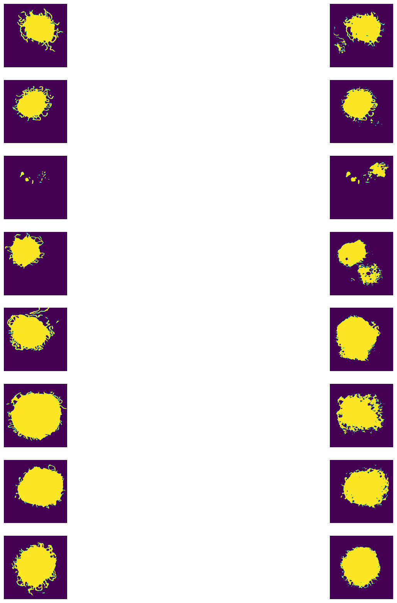

# Image Segmentation

The project implements Image Segmentation using U-Net structure 

U-net algorithm derived from paper "U-Net: Convolutional Networks for Biomedical Image Segmentation" [Paper](https://arxiv.org/abs/1505.04597)

[View the Report Here](https://kyon317.github.io/UnetDemo/output/report.pdf)

---

# Results

  

Ground Truth   vs   Segmented Results

## Graph

  
  

